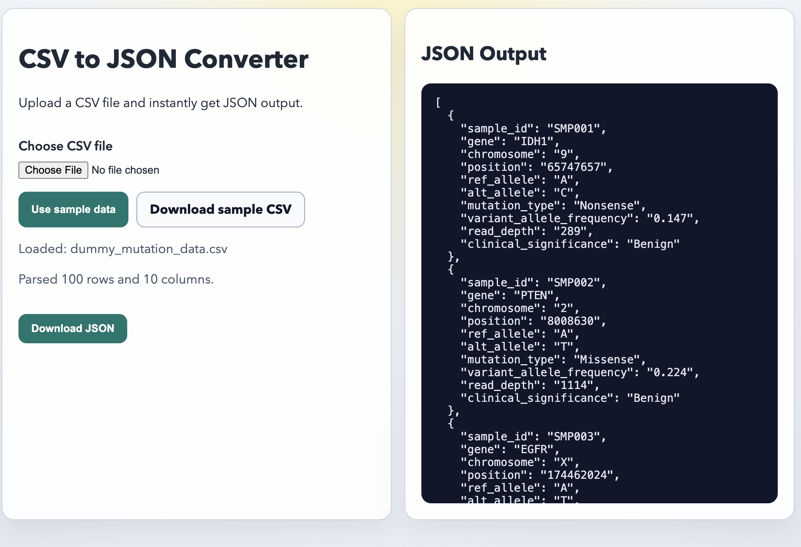

# React + Vite CSV Mutation to JSON Converter

Client-side web app that converts mutation-focused CSV datasets to JSON directly in the browser.

## Screenshot



## Run locally

```bash
npm install
npm run dev
```

## Build and test

```bash
npm run build
npm run test
```

## Features

- Upload a `.csv` file from your machine
- Parse quoted fields, commas inside quotes, and escaped quotes
- Show pretty-printed JSON output in the UI
- Download converted output as `.json`
- Load sample mutation data in one click

## Project structure

```text
src/
  App.jsx                # Main UI flow
  utils/csvToJson.js     # CSV parsing + conversion logic
tests/
  csvToJson.test.mjs     # Parser unit tests
public/
  dummy_mutation_data.csv
```

## Tech stack

- React 18
- Vite 5
- Node test runner (`node --test`)
